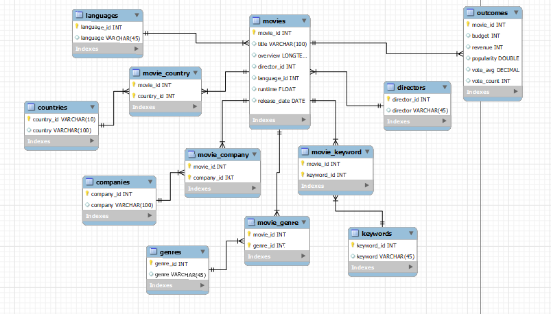

# COSC 61 Final Project - Movie Analysis
This repo contains the materials for the final project of Devon Starr and John D'Avanzo for COSC 61 @ Dartmouth 23X.

# Project Milestone 1

## Original Dataset Description
 Our dataset we found on kaggle contains 4803 `movies`, each with the following attributes:

* `index` - row number, starts at 0
* `budget`
* `genres` - list of genres applicable to the movie, separated by spaces
* `homepage` - 
* `id` - unique identifier number for the movie
* `keywords` - some tags given to the movie
* `original_language`
* `original_title` - title of the movie
* `overview` - brief description of the movie
* `popularity` - strange popularity index (highest is around 900, lowest is around 0)

# Example Questions

## The following are 4 questions which exemplify what can be done with the given dataset:

1. Which movie genres are the most popular and where?
2. Is there a correlation between budget and popularity?
3. Do movies with high spend usually have proportionately higher returns?
4. How did the Covid pandemic impact movie revenue in different countries?

# Milestone 2

