# Project Milestone 2 - Movie Analysis Database Implementation Details
Below are the details of how we imported and prepared our data as well as how we built our database.

## Schema Creation in MySQL
Schema creation is done through the `database_creation_script.sql`. This code was generated through running `SHOW CREATE TABLE` on all of the tables we had created and modifying slightly their foreign key references.

Here are screenshots of the schema from these commands:

`companies`
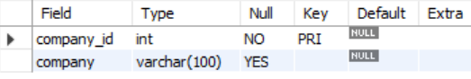
`countries`
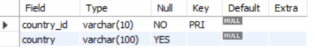
`directors`
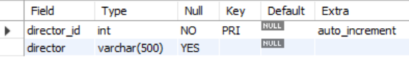
`genres`
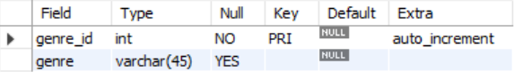
`keywords`
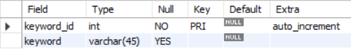
`languages`
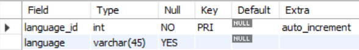
`movie_company`
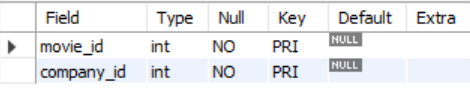
`movie_country`
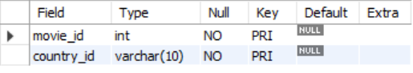
`movie_genre`
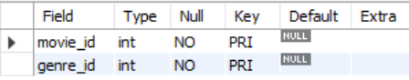
`movie_keyword`
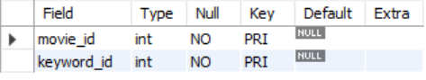
`movies`
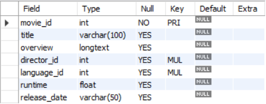
`outcomes`
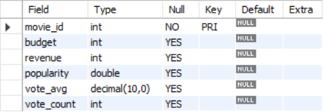


## Pre Importation
Before importing the data to MySQL workbench, we filtered out fields from the original dataset that we did not plan on using in our database for the sake of simplicity. We also decomposed the data into two files, `data_1` and `data_2`. `data_1` contained the general attributes (`index`, `budget`, `keywords`, `original_language`, `overview`, `popularity`, `release_data`, `revenue`, `runtime`, `title`, `vote_average`, `vote_count`, `director`) while `data_2` contained only the fields in json format (`production_companies`, `production_countries`) in addition to `index`, allowing for more careful and nuanced inspection and decomposition of the json text.

## Import Method
We were unable to utilize the Table Import Wizard built into MySQLWorkbench because of the inconsistent nature of the formatting of our original data. Instead, we manually set the parameters for import using the `LOAD DATA LOCAL INFILE` command in SQL. 

* In order to use this command with the local mysql connection, we had to add this option in the advanced tab of our connection settings: `OPT_LOCAL_INFILE=1`

## Import Code
The general syntax for how we loaded our data is as follows:
```
SET GLOBAL local_infile = 1;
LOAD DATA LOCAL INFILE 'pathname/data_file.csv'
INTO TABLE table_to_load_data_into
FIELDS TERMINATED BY ','
ENCLOSED BY '"'
LINES TERMINATED BY '\n'
IGNORE 1 LINES;
```

* In `database_creation_script.sql`, the paths for both data_1.csv and data_2.csv must be absolute paths, not relative paths to these data files. So in order to run these scripts on your local machine, you must change these paths to be absolute paths pointing to the data files. Additionally, mySql requires that all slashes in the path be forward slashes.
* For example: `/Users/name/Desktop/data_1.csv`, `C:/Documents/data/data_2.csv`

## Decomposition After Importation
* Handling JSON text in `production_companies` and `production_countries` fields
    * Given the inconsistent nature of the JSON text, we decided to write a script to decompose the JSON text as a varchar object. The general syntax for the script we wrote is as follows:

    ```
    CREATE TABLE extracted_data (
    movie_id INT,
    variable_name VARCHAR(255),
    variable_id INT
    );

    INSERT INTO extracted_data (movie_id, variable_name, variable_id)
    SELECT index_,
    SUBSTRING(
        original_attribute,
        position('name": "' IN original_attribute) + 8,
        position('"' IN SUBSTRING(original_attribute, position('name": "' IN original_attribue) + 8)) - 1
    ) AS variable_name,
    CAST(
        SUBSTRING(
            original_attribute,
            position('"id": ' IN original_attribute) + 6,
            position('}' IN SUBSTRING(original_attribute, position('"id": ' IN original_attribute) + 6)) - 1
        ) AS DOUBLE
    ) AS variable_id
    FROM data_2;
    ```
* Handling multi-valued varchar attributes in `keywords` and `genres` fields
    * The `keywords` and `genres` fields were multivalued varchar attributes, where each was listed in each record as a series of keywords and genres separated by spaces. This necessitated a script to parse each of the fields and convert them into long form. The general syntax for the script we wrote is as follows:
    ```
    CREATE TABLE keyword_long (
    movie_id INT,
    variable_long VARCHAR(255)
    );
    -- Step 2: Populate the new table with separate genre records
    INSERT INTO variable_long (movie_id, variables_long)
    SELECT
        index_,
        TRIM(SUBSTRING_INDEX(SUBSTRING_INDEX(variables, ' ', n.n), ' ', -1)) AS variables_long
    FROM data_1
    JOIN (
        SELECT 1 AS n UNION ALL
        SELECT 2 UNION ALL
        SELECT 3 UNION ALL
        SELECT 4 UNION ALL
        SELECT 5 -- Add more numbers as needed
    ) n
    ON CHAR_LENGTH(keywords) - CHAR_LENGTH(REPLACE(keywords, ' ', '')) >= n.n - 1
    WHERE TRIM(SUBSTRING_INDEX(SUBSTRING_INDEX(keywords, ' ', n.n), ' ', -1)) <> '';
    ```

## General Cleaning
*  Cleaned the `genres` field so that 'science fiction' is read as 'science_fiction' rather than 'science' and 'fiction'
* Removed the quotation marks from the `country_name` field
* Because of the way the json was parsed, a blank country and blank company were created. To solve this problem, we removed them at the end of the database creation script

## Initial Query
Our first query answering the question "Which movie genres are most popular?" is in `database_queries.sql`. Here are the results:
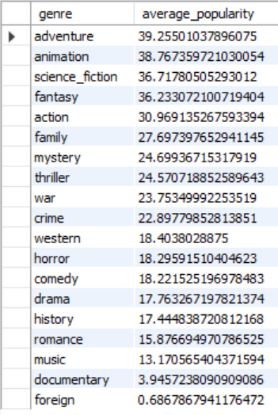