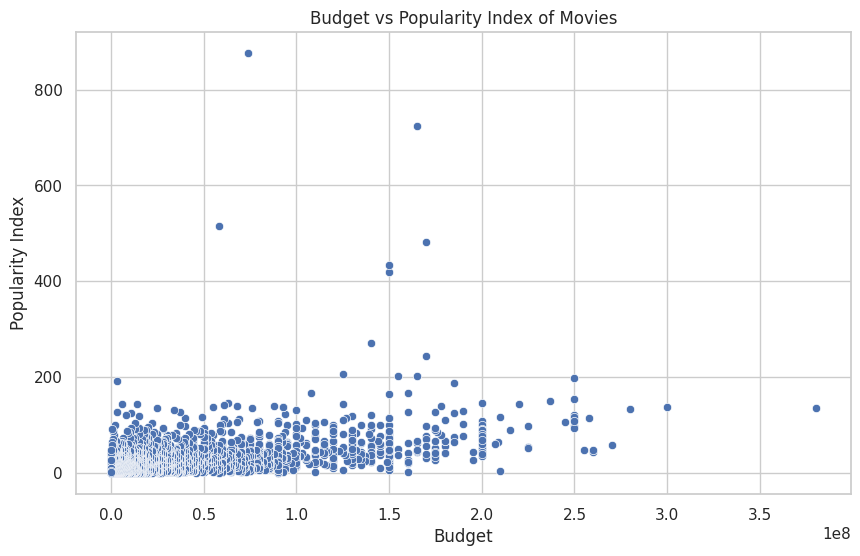
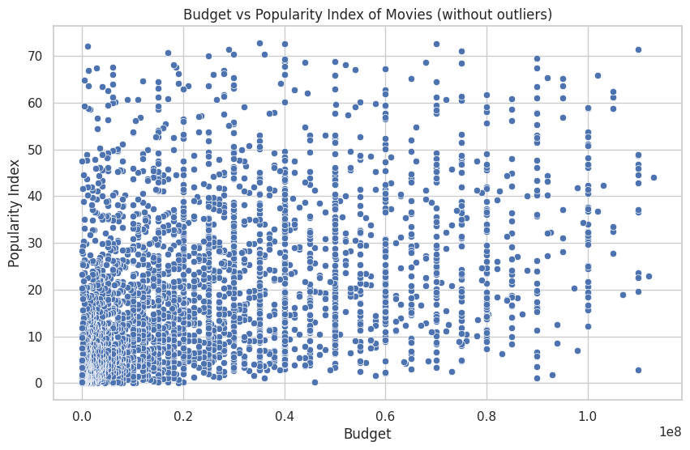
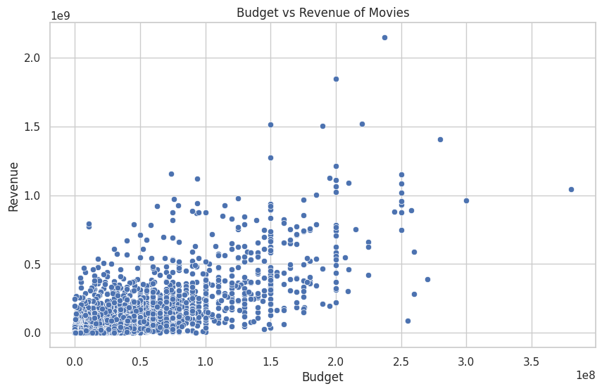
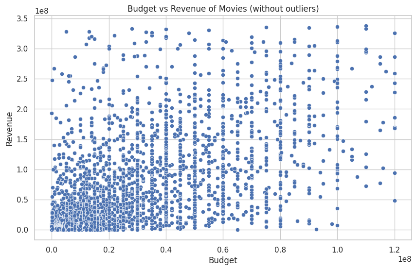
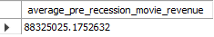

# Project Milestone 4 - Database Enhancement & Answers to Questions

Our major database enhancement is a web game similar to [The Higher Lower Game](http://www.higherlowergame.com/) but instead uses movies and 4 different metrics about them as opposed to just Google searches.


The milestone_4 folder contains the following folders related to our game:

- `app/` — Frontend React app
  - grabs three random movies and your high score from the backend upon loading
  - if your higher lower answer is correct, it grabs a new movie from the backend, updates your score and the metric you're currently judging on
  - if your answer is incorrect, a game over message is shown with your score, and overwrites your high score if necessary.
- `server/` — Express.js server
  - on startup, connects to our MySQL database using an ssh tunnel. For context, our database is hosted on an EC2 Ubuntu instance using `mysql-server`. Specific connection info is in [mysql.js](./server/src/mysql.js)
  - contains three routes which are used by the frontend:
    - `GET /randomMovie` - grabs a random movie from the MySQL database and also grabs an image related to that movie from the pexels api and returns them in the response
    - `GET /highscore` - returns your current highscore according to your cookie
    - `POST /highscore` - sets the high score in your cookie to the `highscore` field in the body of the request

## Our game is hosted online [here](https://cs61johndevon.onrender.com), but to run locally:

1. Clone the repository to your local machine
2. Make sure you have node.js installed on your machine
3. Inside `app/src/App.js`, change the `backendUrl` variable to be equal to 'http://localhost:9090'
4. Inside `server/src/server.js`, change the `frontendUrl` variable to be equal to 'http://localhost:3000'
5. From a terminal `cd`'d to `milestone_4/server`, run the commands `npm install` and `npm start`
   - wait for the console to print "Listening on port 9090"
6. From a terminal `cd`'d to `milestone_4/app`, run the command `npm install` and `npm start`

The website should have opened on a browser tab on your machine :)

# Answers to Questions

All queries used for the answers to these questions are in [this file](../milestone_3/database_queries.sql). They are also listed in codeblocks under each question, respectively

## Question 1: Which movie genres are the most popular and where?

For this question, we wrote a query which finds the genre with the highest average popularity in each country. Some countries have ties for the most popular genre, so those countries have multiple rows in our result. The result is too long to include a screenshot of, so here's the [link to the csv result](question1.csv). 

```
SELECT c.country AS country_name, g.genre AS genre_name, AVG(o.popularity) AS average_popularity
FROM outcomes o
JOIN movie_genre mg ON o.movie_id = mg.movie_id
JOIN genres g ON mg.genre_id = g.genre_id AND g.genre NOT IN ("tv", "movie")
JOIN movie_country mc ON o.movie_id = mc.movie_id
JOIN countries c ON mc.country_id = c.country_id
GROUP BY g.genre, c.country
HAVING AVG(o.popularity) = (
    SELECT MAX(avg_pop)
    FROM (
        SELECT AVG(o2.popularity) AS avg_pop
        FROM outcomes o2
        JOIN movie_genre mg2 ON o2.movie_id = mg2.movie_id
        JOIN genres g2 ON mg2.genre_id = g2.genre_id AND g2.genre NOT IN ("tv", "movie")
        JOIN movie_country mc2 ON o2.movie_id = mc2.movie_id
        JOIN countries c2 ON mc2.country_id = c2.country_id
        WHERE c2.country = c.country
        GROUP BY g2.genre
    ) AS subquery
)
ORDER BY c.country;
```

Our query collects all of the necessary information indluding the country, genre, and popularity fields. It does so using the movie_genre and movie_country tables as the link, es it is these tables which contain the `movie_id`. We group by both genre and country so that we can see the breakdown of genre by country. The subqury withing the `HAVING` clause calculates the maximum average popularity for each genre within the same country. It does so by repeating the join operations and grouping by genre. Then, we order by country so that results on a by-country basis can easily be read from the CSV. For example, it can easily be obtained by a quick glance at the CSV that *animation* is the most popular genre in the United States according to the data.


## Question 2: Is there a correlation between budget and popularity?

For this question, we used the following query to create a csv file which contained each 
movie's budget and popularity as a separate row, and used some python scripting ([Link to Google Colab](https://colab.research.google.com/drive/1PBrDKUlDtLw0XOagA_O-mObNSddJP4Fw?usp=sharing)) to visualize a scatter plot of the data to see if there was any correlation between the two.


Version including all data points:



Version excluding outliers:



Upon inspecting these graphs it does not seem lke there is a correlation between budget and popularity, as the data points seem to be scattered all over the place, not following any sort of pattern.


## Question 3: Do movies with high budgets usually have higher returns?

Similarly to the previous question for budget vs. popularity, we used a query to create a csv file which contained each 
movie's budget and revenue as a separate row, and used some python scripting ([Link to Google Colab](https://colab.research.google.com/drive/1PBrDKUlDtLw0XOagA_O-mObNSddJP4Fw?usp=sharing)) to visualize a scatter plot of the data to see if there was any correlation between the two.


Version including all data points:



Version excluding outliers:



Upon inspecting these graphs it again does not seem like there is an obvious correlation between budget and revenue, as the data points seem to be scattered all over the place, not following any obvious path. This is especailly true when we consider the scatterplot without outliers.

## Question 4: How did the Great Recession affect movie revenue in the United States?

Our original question was "How did the Covid pandemic impact movie revenue in different countries?" However, our data does not contain data on movies released after 2017. Instead, we will compare movie revenues in the U.S. directly before and during the 2008 Great Recession.

For the purposes of this analysis, we consider movies released in 2006 and 2007 
'pre-recession'and movies released in 2008 as 'during-recession'. To avoid issues of the 
time value of money, we adjust for 1.4% yearly devaluation of the USD.




We use two blocks of code to answer this question. The first one calculates average movie revenue among movies which were released pre recession. The second does so for movies which were released during the recession. 

```
SELECT AVG(revenue) * 1.014 AS average_pre_recession_movie_revenue
FROM movies as m
JOIN movie_country mc ON m.movie_id = mc.movie_id
JOIN outcomes o ON m.movie_id = o.movie_id
WHERE country_id = 'US'
AND release_date BETWEEN '2006-01-01' AND '2008-01-01';
```

```
SELECT AVG(revenue) AS average_recession_movie_revenue
FROM movies as m
JOIN movie_country mc ON m.movie_id = mc.movie_id
JOIN outcomes o ON m.movie_id = o.movie_id
WHERE country_id = 'US'
AND release_date BETWEEN '2008-01-01' AND '2009-01-01';
```

Each one follows the same design. We calculate average revenue of movies by joining the `movies` table with the `movie_country` table to filter only to the United States and then we join with the `outcomes` table as that is where data on movie revenue is held. Finally, we condiiton in the `WHERE` clause that the release date falls within the specified release range (either before or during the recession, respectively).

According to the results from our queries, the average pre-recession movie revenue was about $88,325,025, whereas the average during-recession movie revenue was about $79,142,953. This is almost a $10 million difference, which is pretty substantial.

