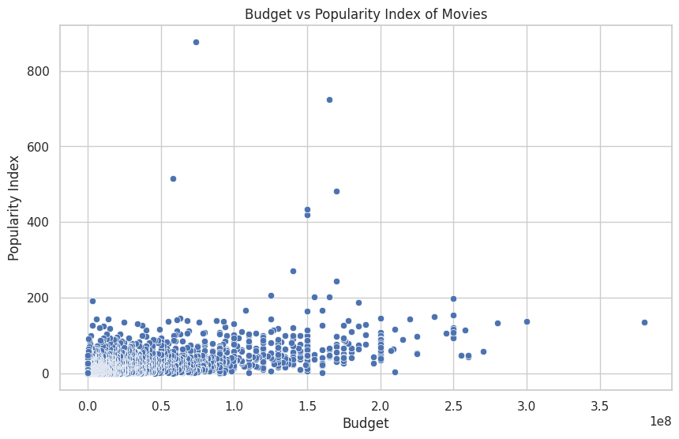

# COSC 61 Final Project - Database Enhancement & Answers to Questions

Our major database enhancement is a web game similar to [The Higher Lower Game](http://www.higherlowergame.com/) but instead uses movies and 4 different metrics about them as opposed to just Google searches.

The milestone_4 folder contains the following folders related to our game:

- `app/` — Frontend React app
  - grabs three random movies and your high score from the backend upon loading
  - if your higher lower answer is correct, it grabs a new movie from the backend, updates your score and the metric you're currently judging on
  - if your answer is incorrect, a game over message is shown with your score, and overwrites your high score if necessary.
- `server/` — Express.js server
  - on startup, connects to our MySQL database using an ssh tunnel. For context, our database is hosted on an EC2 Ubuntu instance using `mysql-server`. Specific connection info is in [mysql.js](./server/src/mysql.js)
  - contains three routes which are used by the frontend:
    - `GET /randomMovie` - grabs a random movie from the MySQL database and returns it in the response
    - `GET /highscore` - returns your current highscore according to your cookie
    - `POST /highscore` - sets the high score in your cookie to the `highscore` field in the body of the request

## To run locally,

1. Clone the repository to your local machine
2. Make sure you have node.js installed on your machine
3. Inside `app/src/App.js`, change the `backendUrl` variable to be equal to 'http://localhost:9090'
4. Inside `server/src/server.js`, change the `frontendUrl` variable to be equal to 'http://localhost:3000'
5. From a terminal `cd`'d to `milestone_4/server`, run the commands `npm install` and `npm start`
   - wait for the console to print "Listening on port 9090"
6. From a terminal `cd`'d to `milestone_4/app`, run the command `npm install` and `npm start`

The website should have opened on a browser tab on your machine :)

## Question 2: Is there a correlation between budget and popularity?

For this question, we used the following query to create a csv file which contained each 
movie's budget and popularity as a separate row, and used some python scripting ([Link to Google Colab](https://colab.research.google.com/drive/1PBrDKUlDtLw0XOagA_O-mObNSddJP4Fw?usp=sharing)) to visualize a scatter plot of the data to see if there was any correlation between the two.

Version including all data points:

Version excluding outliers:

Upon inspecting these graphs it does not seem lke there is a correlation between budget and popularity, as the data points seem to be scattered all over the place, not following any obvious path.